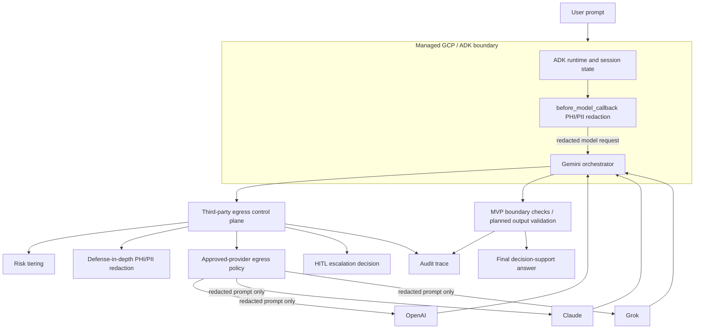

# Architecture

## Data Plane

The data plane keeps the original multi-LLM architecture: provider diversity, retry/fallback, local cost summaries, and Gemini synthesis. The local usage summary in `metrics.py` is ephemeral demo telemetry rather than audit evidence; durable metric events should be emitted through sanitized audit events.

## Control Plane

The Responsible AI control plane runs in two places:

- `pre_router.py` redacts text parts in the ADK model request before Gemini receives them. Raw user input may still exist inside the ADK runtime/session boundary before this callback runs.
- The third-party egress gate redacts and validates again before OpenAI, Claude, or Grok calls.

- `risk.py` classifies the request.
- `privacy.py` redacts sensitive identifiers.
- `policy.py` enforces approved-provider and redaction requirements.
- `escalation.py` determines human review.
- `audit.py`, `audit_store.py`, and `audit_hashing.py` record sanitized control decisions in a JSONL hash chain.

The current MVP redaction and risk controls are deterministic heuristics. `privacy.py` is regex-based and does not cover all real-world PHI/PII forms, and `risk.py` is lexical keyword matching rather than a semantic classifier. Provider responses are currently plain text without enforced provider JSON mode, response schema, or output-side clinical-boundary validation.

## Traceability

A single trace ID correlates every governance event for one request. The `before_model_callback` stores a trace ID in ADK session state on the first model call (`observability.ensure_trace_id`), and the provider tools reuse it through their injected `tool_context`. As a result, the pre-router redaction event, risk classification, policy decision, HITL escalation, and each provider call/outcome for one invocation share the same trace ID in the audit log and can be retrieved together with `get_audit_log(trace_id)`.

The default local audit sink persists sanitized JSONL events to `audit_logs/dev_audit.jsonl`. Each stored event includes a payload hash, previous event hash, and event hash computed from canonical JSON after sanitization. The persistence allowlist favors structured fields such as provider, action, risk tier, reason codes, policy IDs, model provenance, redaction summaries, token counts, and safe error categories; generic free-text reasons, names, arbitrary values, prompts, responses, excerpts, and reviewer IDs are not persisted. `scripts/verify_audit_chain.py <path>` verifies the chain and detects accidental payload edits, event reordering, middle deletion, and insertion. The demo uses a process-local thread lock for JSONL appends; multi-process writers need a file lock, database, append-only object store, or external audit service. Appending reloads and verifies the existing chain, which is O(n) per write and acceptable only at MVP/demo scale. A partial final-line write from a crash requires manual log rotation or recovery before appends resume. This is integrity-verifiable, not tamper-proof: a writer with filesystem access can rewrite the entire file and recompute hashes unless production storage adds protected HMAC/signing, immutable storage, object-store versioning, append-only controls, or external digest anchoring.

If raw PHI is accidentally persisted, the safe response is to rotate the affected log, preserve a restricted incident copy only if policy requires it, create a documented scrub event in a new log, and accept the chain break instead of silently rewriting history.

When no ADK session state is available (direct calls or unit tests), the governance layer mints a fresh trace ID per request rather than failing.

## Trust Boundaries

- Local ADK runtime.
- Managed GCP agent runtime deployment profile.
- External model providers.
- Logs, audit events, metrics, and secrets.

The local ADK process receives the user input and may write it to session state/history before `before_model_callback=redact_before_model` mutates the ADK `LlmRequest`. The callback prevents raw PHI/PII from reaching the Gemini model request by default, and the MVP redacts again before egress to non-Google third-party LLM providers such as OpenAI, Claude, and Grok. Production use still requires ingest-time redaction before session write, content-logging suppression, retention controls, telemetry review, and BAA/contract review for the managed GCP boundary and every external provider.

MVP redaction scope is text-only. Attachments, images, files, and other `inline_data` parts require extraction/OCR and managed sensitive-data inspection before production use.

The MVP keeps GCP product names inside the deployment profile so the governance pattern remains portable.
