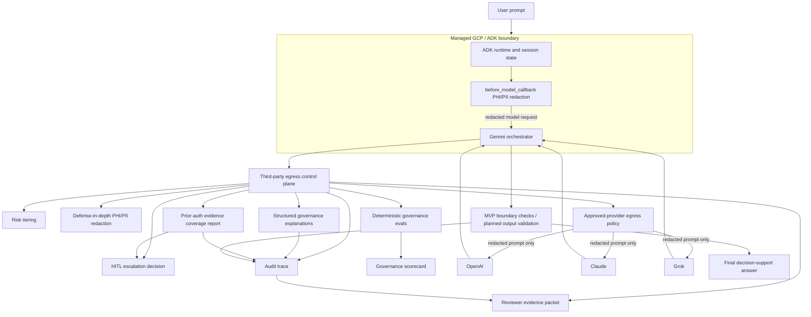

# Architecture

## Data Plane

The data plane keeps the original multi-LLM architecture: provider diversity, retry/fallback, local cost summaries, and Gemini synthesis. The local usage summary in `metrics.py` is ephemeral demo telemetry rather than audit evidence; durable metric events should be emitted through sanitized audit events.

## Control Plane

The Responsible AI control plane runs in two places:

- `pre_router.py` redacts text parts in the ADK model request before Gemini receives them. Raw user input may still exist inside the ADK runtime/session boundary before this callback runs.
- The third-party egress gate redacts and validates again before OpenAI, Claude, or Grok calls.

- `risk.py` classifies the request.
- `privacy.py` redacts sensitive identifiers.
- `policy.py` enforces approved-provider and redaction requirements.
- `explainer.py` creates deterministic governance explanations with reason codes, policy IDs, and safe human-readable rationale without Chain-of-Thought.
- `evidence_coverage.py` creates a prior-authorization evidence coverage report that marks documentation elements as present, missing, insufficient, or not applicable for human review.
- `escalation.py` determines human review.
- `review.py` records human review closure and derives terminal trace state from sanitized audit events.
- `audit.py`, `audit_store.py`, and `audit_hashing.py` record sanitized control decisions in a JSONL hash chain.
- `evidence_packet.py` exports reviewer-ready packets from sanitized JSONL audit logs.
- `scripts/run_redteam_eval.py`, `evals/privacy/run_redaction_benchmark.py`, and `evals/fairness/run_invariance_eval.py` measure deterministic governance behavior without external LLM calls.
- `scripts/generate_governance_scorecard.py` summarizes deterministic reports and sample audit verification into `governance/governance_scorecard.md`.

The current MVP redaction, risk, and evidence coverage controls are deterministic heuristics. `privacy.py` is regex-based and does not cover all real-world PHI/PII forms, `risk.py` is lexical keyword matching rather than a semantic classifier, and `evidence_coverage.py` is not a payer-policy engine or medical-necessity model. Provider responses are currently plain text without enforced provider JSON mode, response schema, or output-side clinical-boundary validation.

Structured explanations are governance records, not model Chain-of-Thought. They are populated from policy factors, reason codes, evidence coverage status, redaction summaries, provenance, and human-review state. Persistent artifacts must use safe views, sanitized audit payloads, and redacted excerpt hashes instead of raw prompts, raw responses, raw source excerpts, reviewer identities, or hidden reasoning.

## Governance Artifact Lifecycle

One governed request should produce a correlated artifact set:

1. A trace ID is created or reused through `observability.ensure_trace_id`.
2. Runtime governance objects may temporarily contain sensitive request data.
3. Safe views are written to the audit sink through sanitize-on-write.
4. The JSONL audit store hashes only sanitized payloads.
5. `review.resolve_trace_state()` derives terminal review status by replaying sanitized events.
6. `evidence_packet.py` exports reviewer-facing evidence from sanitized events.
7. `generate_governance_scorecard.py` summarizes deterministic evals, sample audit verification, and CI-observed control status.

This lifecycle is designed for defensible inspection. It is not a production retention, legal erasure, immutable logging, or clinical-decision workflow.

## Evaluation Plane

The Phase 5 eval layer is intentionally deterministic so it can run in fast CI and local review without provider credentials:

- `scripts/run_redteam_eval.py` evaluates 36 prior-auth control-plane cases across prompt injection, indirect injection, PHI exfiltration, redaction evasion, autonomy-boundary pressure, medical-necessity and coverage-decision pressure, system prompt leakage attempts, provider egress policy, fanout abuse, fallback safety, and hallucinated evidence.
- `evals/privacy/run_redaction_benchmark.py` computes entity-level precision, recall, F1, false-positive count, false-negative count, and metrics by identifier type. CI gates currently apply only to email, formatted phone, SSN, and member ID recall because those are the identifier classes the regex redactor is expected to catch.
- `evals/fairness/run_invariance_eval.py` is a structured invariance regression that uses synthetic demographic variants of the same prior-auth packet and compares evidence-coverage fields, human-review requirement, and prohibited decision boundaries rather than free-text rationales.

These evals measure regression behavior for the MVP control plane. They do not prove production-grade PHI detection, production fairness, or broad adversarial robustness.

## Evidence Packaging And CI

`scripts/export_audit_packet.py --trace-id TRACE_ID --audit-log PATH --output-dir .tmp_evidence_packet_check` creates a local reviewer packet in an ignored scratch directory. The packet contains sanitized audit events, audit-chain verification, terminal trace state, governance explanations, evidence coverage, redaction summary, model provenance, human review status, and a markdown reviewer summary. Packet export uses the canonical stored trace ID, rebuilds the packet folder on each export, and derives trace state through the shared `review.replay_trace_state()` helper rather than replaying events separately. CI may still export packets under `examples/evidence_packets/` as uploaded workflow artifacts; generated packet subfolders are ignored locally while `.gitkeep` keeps the directory present.

Redaction totals in packets are finding observations summed across audit events. They are not deduplicated patient/entity counts because the audit log does not retain raw values or stable redaction span IDs. The packet exposes `source_event_count` and `counting_strategy` so reviewers can interpret the count correctly.

`.github/workflows/governance-ci.yml` runs fast deterministic governance checks for pull requests and manual dispatches. It runs the full unit suite, discrete human-review and observability tests, red-team eval, privacy benchmark, invariance eval, sample audit-chain verification, and scorecard generation. The scorecard uses actual GitHub Actions step outcomes for unit, human-review, and observability controls. It also reports markdown-summary parse errors if an eval report format changes. Uploaded CI artifacts include eval reports, the scorecard, and the evidence packet folder.

Cloud Build remains the GCP deployment and deployment-evidence workflow. GitHub Actions owns repository governance checks and reviewer artifacts; it does not replace `cloudbuild.yaml`.

## Observability Plane

`multi_model_agent/telemetry.py` provides optional OpenTelemetry governance spans and operational metrics without making OpenTelemetry a hard runtime dependency. Default local/dev mode is no-op, and tests can enable deterministic in-memory capture without a collector. When enabled, spans cover redaction, risk classification, policy egress checks, provider calls, HITL escalation, output boundary validation, and an ADK-managed Gemini synthesis handoff marker.

Telemetry attributes use a strict allowlist and sanitizer. They can include trace IDs, risk tier, policy IDs, redaction counts, provider/model identifiers, token counts, fallback/retry state, and estimated cost. They must not include prompts, responses, raw PHI, source excerpts, reviewer IDs, arbitrary exception messages, or hidden reasoning. Operational telemetry is not audit evidence unless the event is explicitly persisted through the sanitized audit sink.

## Traceability

A single trace ID correlates every governance event for one request. The `before_model_callback` stores a trace ID in ADK session state on the first model call (`observability.ensure_trace_id`), and the provider tools reuse it through their injected `tool_context`. As a result, the pre-router redaction event, risk classification, policy decision, structured explanation, evidence coverage report, HITL escalation, and each provider call/outcome for one invocation share the same trace ID in the audit log and can be retrieved together with `get_audit_log(trace_id)`.

The default local audit sink persists sanitized JSONL events to `audit_logs/dev_audit.jsonl`. Each stored event includes a payload hash, previous event hash, and event hash computed from canonical JSON after sanitization. The persistence allowlist favors structured fields such as provider, action, risk tier, reason codes, policy IDs, model provenance, redaction summaries, token counts, evidence coverage reports, source references, hashed redacted excerpts, and safe error categories; generic free-text reasons, names, arbitrary values, prompts, responses, excerpts, and reviewer IDs are not persisted. `scripts/verify_audit_chain.py <path>` verifies the chain and detects accidental payload edits, event reordering, middle deletion, and insertion. The demo uses a process-local thread lock for JSONL appends; multi-process writers need a file lock, database, append-only object store, or external audit service. Appending reloads and verifies the existing chain, which is O(n) per write and acceptable only at MVP/demo scale. A partial final-line write from a crash requires manual log rotation or recovery before appends resume. This is integrity-verifiable, not tamper-proof: a writer with filesystem access can rewrite the entire file and recompute hashes unless production storage adds protected HMAC/signing, immutable storage, object-store versioning, append-only controls, or external digest anchoring.

If raw PHI is accidentally persisted, the safe response is to rotate the affected log, preserve a restricted incident copy only if policy requires it, create a documented scrub event in a new log, and accept the chain break instead of silently rewriting history.

When no ADK session state is available (direct calls or unit tests), the governance layer mints a fresh trace ID per request rather than failing.

## Trust Boundaries

- Local ADK runtime.
- Managed GCP agent runtime deployment profile.
- External model providers.
- Logs, audit events, metrics, and secrets.

The local ADK process receives the user input and may write it to session state/history before `before_model_callback=redact_before_model` mutates the ADK `LlmRequest`. The callback prevents raw PHI/PII from reaching the Gemini model request by default, and the MVP redacts again before egress to non-Google third-party LLM providers such as OpenAI, Claude, and Grok. Production use still requires ingest-time redaction before session write, content-logging suppression, retention controls, telemetry review, and BAA/contract review for the managed GCP boundary and every external provider.

MVP redaction scope is text-only. Attachments, images, files, and other `inline_data` parts require extraction/OCR and managed sensitive-data inspection before production use.

The MVP keeps GCP product names inside the deployment profile so the governance pattern remains portable.
